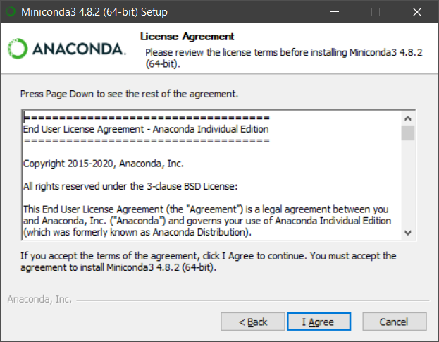
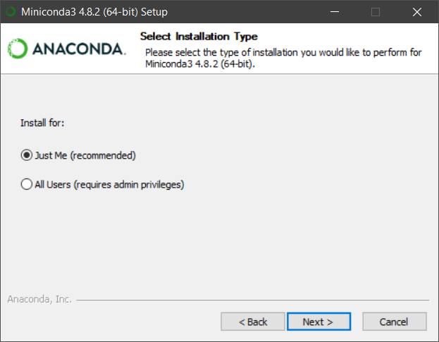
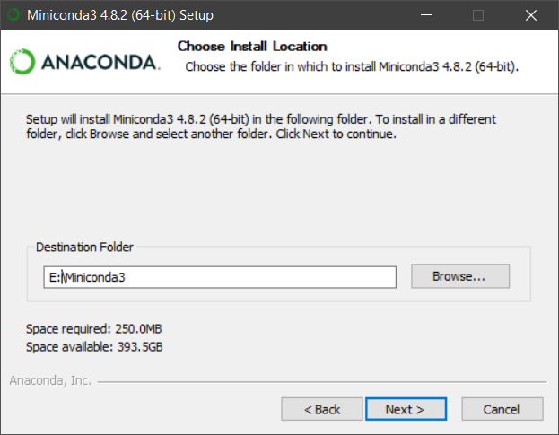
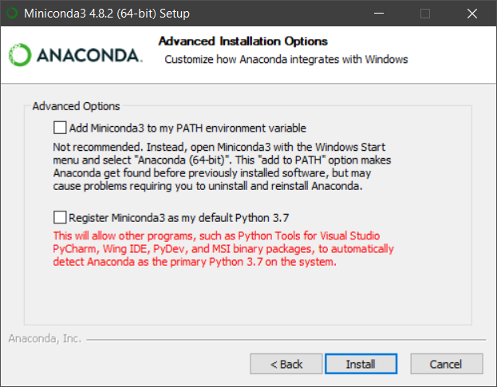
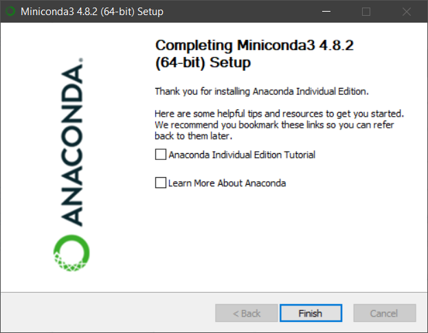

## Get Python

To use FMPy you need Python. If you do not have a Python environment on your machine you can install
[Anaconda](https://www.anaconda.com/download/) that comes with a range of packages for scientific computing. If you want
to install your packages individually you can use [Miniconda](https://conda.io/miniconda.html).

## Required Packages

Depending on what you intent to use FMPy for you might only need certain packages.

| Function                  | Required packages                         |
|---------------------------|-------------------------------------------|
| Read modelDescription.xml | lxml                                      |
| Simulate FMUs             | numpy, pathlib, pywin32 (only on Windows) |
| Plot results              | matplotlib                                |
| Parallelization example   | dask                                      |
| Download example FMUs     | requests                                  |
| Graphical user interface  | pyqt, pyqtgraph                           |


## Install with Conda

To install FMPy from [conda-forge](https://conda-forge.org/) including all dependencies type

```bash
conda install -c conda-forge fmpy
```

To install FMPy w/o dependencies type

```bash
conda install -c conda-forge fmpy --no-deps
```

and install the dependencies with

```bash
conda install <packages>
```

## Install with PIP

To install FMPy from [PyPI](https://pypi.python.org/pypi) including all dependencies type

```bash
python -m pip install fmpy[complete]
```

To install FMPy w/o dependencies type

```bash
python -m pip install fmpy --no-deps
```

and install the dependencies with

```bash
python -m pip install <packages>
```


## Install from Source

To install the latest development version directly from GitHub type

```bash
python -m pip install https://github.com/CATIA-Systems/FMPy/archive/develop.zip
```


## Installation without an Internet Connection

If you don't have access to the internet or you're behind a firewall and cannot access [PyPI.org](https://pypi.org/) or [Anaconda Cloud](https://anaconda.org/) directly you can download and copy the following files to the target machine:

- the [Anaconda Python distribution](https://www.anaconda.com/download/)
- the FMPy [Conda package](https://anaconda.org/conda-forge/fmpy/files) **or** [Python Wheel](https://pypi.org/project/fmpy/#files)
- the PyQtGraph [Conda package](https://anaconda.org/anaconda/pyqtgraph/files) **or** [Python Wheel](https://pypi.org/project/pyqtgraph/#files) (only required for the GUI)

After you've installed Anaconda, change to the directory where you've copied the files and enter

```
conda install --no-deps fmpy-{version}.tar.bz2 pyqtgraph-{version}.tar.bz2
```

to install the Conda packages **or** the Python Wheels with

```
python -m pip install --no-deps FMPy-{version}.whl pyqtgraph-{version}.tar.gz
```

where `{version}` is the version you've downloaded.


## For Dummies

This installation

- does not require admin privileges
- does not modify registry and PATH
- can easily be removed by running the uninstaller

1. Download and run the [Miniconda Installer](https://repo.anaconda.com/miniconda/Miniconda3-latest-Windows-x86_64.exe)

2. Click `Next`


3. Click `I Agree`


4. Select `Just Me (recommended)` and click `Next`



5. Select a local folder where you have write access (not a network folder) and click `Next`



6. Uncheck both options and click `Install`



7. Uncheck both options and click `Finish`



8. Open `Start Menu > Anaconda Prompt (Miniconda3)` and run the command `conda install -y -c conda-forge fmpy`

```
(base) C:\>conda install -y -c conda-forge fmpy
Collecting package metadata (current_repodata.json): done
Solving environment: done

...

Downloading and Extracting Packages

...

Preparing transaction: done
Verifying transaction: done
Executing transaction: done
```

### Run the FMPy GUI

Open `Start Menu > Anaconda Prompt (Miniconda3)` and run the command `python -m fmpy.gui`
